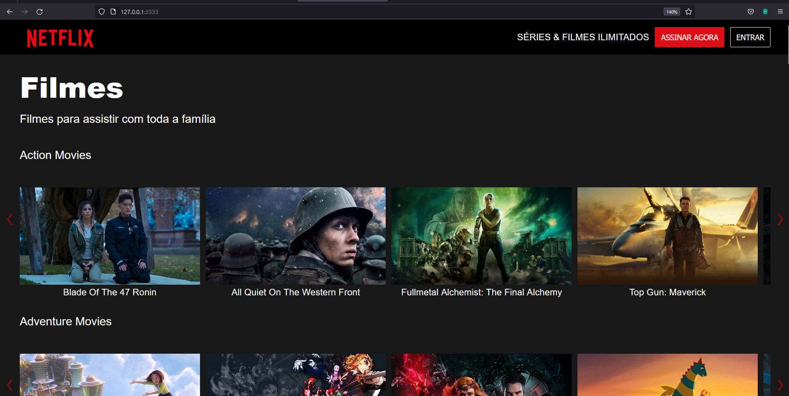

# Projeto - Clone Netflix 
## Desenvolvido através do webnário da <a hrf="https://www.youtube.com/watch?v=JxZf4mxtu64&t=67s" targert="_blank">DIO</a>


Tecnologias utilizadas </br >
HTML | CSS | JavaScript | NodeJS

## Dependencias
- NodeJS >= 14 LTS

## Realizar o clone deste projeto:
````
git clone 
````
Acesse o projeto
````
cd netflix-clone3.0
````
Utilize seu terminal para intalar o express:
````
npm i express
````
Acesse o Netflix Clone:
````
http://localhost:3333

````


